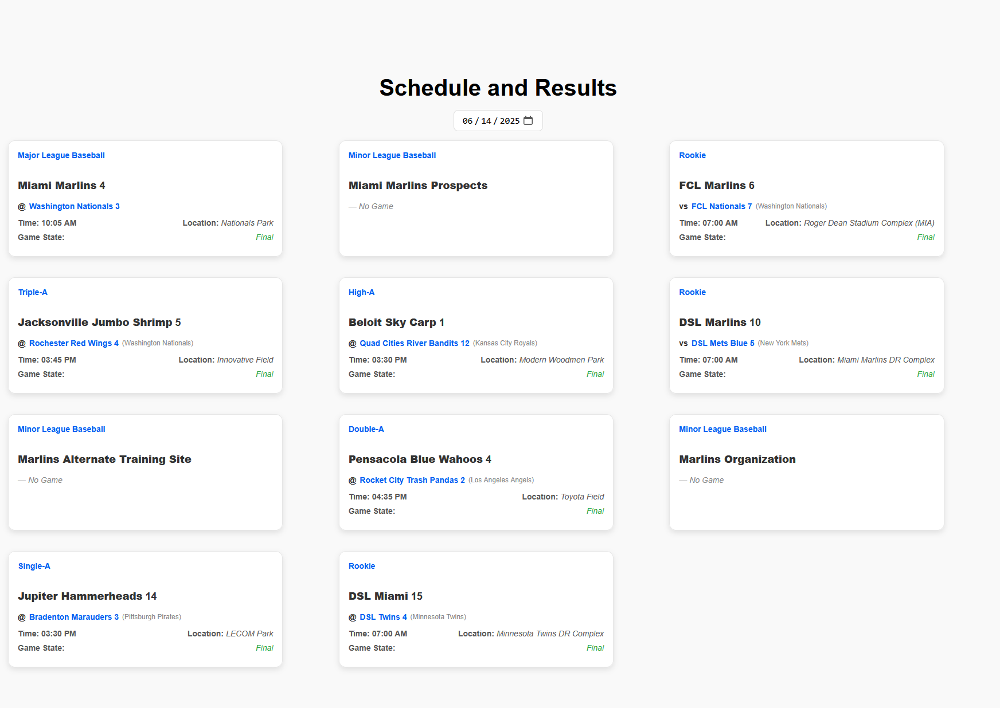

# marlins-app

This project was created using **Vite**, **React**, and **TypeScript**. I aimed to keep the setup minimal while still meeting the requirements for displaying sports data to the user.

### Preview


### Libraries Used:
- **TanStack React Query**: For data fetching and caching.
- **Axios**: For making HTTP requests.
- **Luxon**: For date parsing and manipulation.
- **QS**: For query string parsing.

### Data Layer:
Most of the data handling is done through parsing API responses. I focused on caching team information to optimize performance for faster lookups. While there may be better ways to handle some of the data requirements using the [MLB Stats API](https://statsapi.mlb.com/), I didn't have access to an account at the time.

### Date Picker:
I used the native HTML `<input type="date">` for the date picker, as it provides a simple and user-friendly UI. Combined with Luxon for date parsing and manipulation, this was the perfect solution for handling dates without additional libraries.

### Styling:
I kept the styling simple and clean, and no external libraries were used for that. All styles are written in **CSS Modules** to scope them to individual components.

### Future Expansion:
The project is designed to be lightweight with a data layer that does most of the heavy lifting. If the project were to be expanded, I would likely consider using heavier tooling like **Zustand** or other state management solutions.

## Installation

First start by cloning the repo

```bash
git clone https://github.com/FultonG/marlins-app.git
```

Next navigate to the repository

```bash
cd marlins-app
```

Install the required node modules by running

```bash
npm install
```

To run the application locally run

```bash
npm run dev
```

The application should now be available on the default port

```
http://localhost:5173/
```


